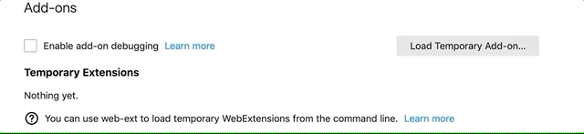

<h1>Available for 

</h1>

# NightCore Pitch Extension for Youtube

NightCore Pitch was created to make it easier to listen to youtube music in the style of happy hardcore / uk hardcore by adding a 26% pitch.

# Install

1. _Open firefox browser and in the url type "about:debugging" to open extension tab._

   

2. _When the extension tab is open, make sure the debugging checkbox is enabled. Then click the "load temporary addon" to install the extension. Note: the file to load is <strong>manifest.json</strong>_

   
